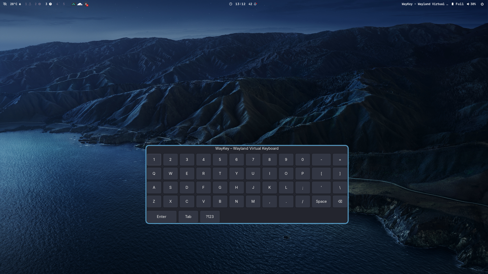

# WayKey – Wayland Virtual Keyboard

WayKey is a virtual on-screen keyboard designed specifically for Wayland environments. It provides a full QWERTY keyboard interface with clickable buttons that send keystrokes to the active Wayland window using the `wtype` tool.

## Features

- Full QWERTY keyboard layout with letters, numbers, and symbols
- Support for special keys (Enter, Backspace, Space, Tab)
- Modern GTK interface with responsive layout
- Works seamlessly on Wayland compositors
- Secure, no root privileges required

## Dependencies

- GTK 3 development libraries (`libgtk-3-dev` on Debian/Ubuntu)
- `wtype` (Wayland typing tool) - install from [wtype GitHub](https://github.com/Wellington1993/wtype)
- CMake (for building)
- A C compiler (gcc or clang)

## Build Instructions

1. Install dependencies:

   **Ubuntu/Debian:**
   ```bash
   sudo apt update
   sudo apt install build-essential cmake libgtk-3-dev
   ```

   **Fedora/RHEL:**
   ```bash
   sudo dnf install gcc cmake gtk3-devel
   ```

   **Arch Linux:**
   ```bash
   sudo pacman -S gcc cmake gtk3
   ```

2. Install `wtype`:
   ```bash
   # Clone and build wtype
   git clone https://github.com/Wellington1993/wtype.git
   cd wtype
   make
   sudo make install  # or copy to a directory in your PATH
   ```

3. Build WayKey:

   ```bash
   mkdir build
   cd build
   cmake ..
   make
   ```

4. Run the application:

   ```bash
   ./waykey
   ```

## Usage

1. Launch WayKey by running `./waykey` from the build directory.
2. The virtual keyboard will appear as a window with clickable keys.
3. Click on keys to type them in the active application.
4. Close the window to exit the application.

## Configuration

WayKey uses the `wtype` command-line tool to send keystrokes. Make sure `wtype` is in your PATH for the application to work correctly.

## Screenshot



*Note: This is a placeholder image. Actual application appearance may vary.*

## Contributing

Contributions are welcome! Please feel free to submit a Pull Request. For major changes, please open an issue first to discuss what you would like to change.

## License

This project is licensed under the MIT License - see the [LICENSE](LICENSE) file for details.

## CI/CD

This project uses GitHub Actions for continuous integration and automated releases. The workflow includes:
- Building the application on Ubuntu
- Running basic code analysis
- Creating releases automatically when changes are pushed to the main branch